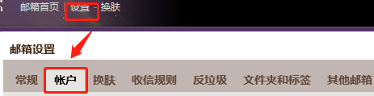
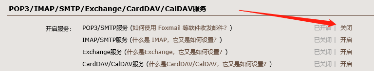
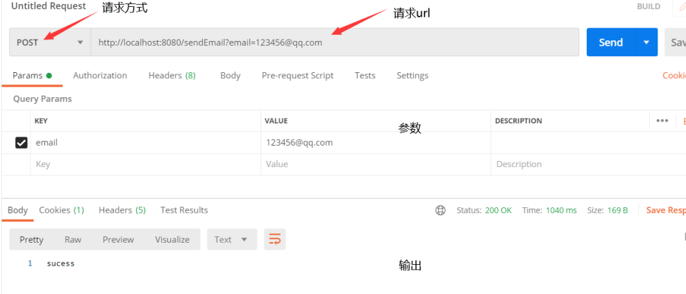
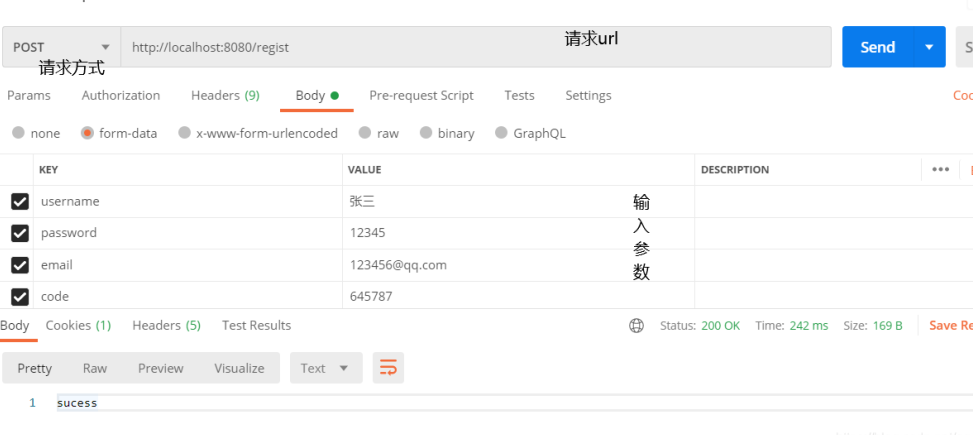
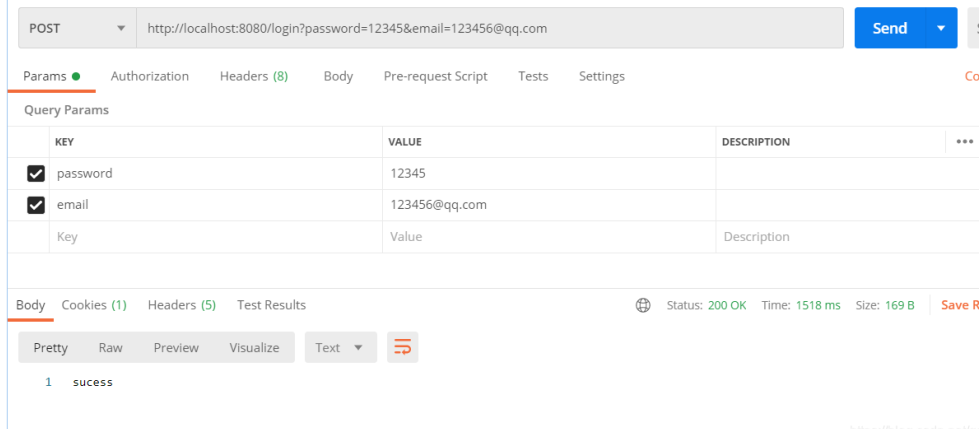

# SpringBoot 实现QQ邮箱登录注册 

## 1. 登录注册思路   
### 1.1 思路
```text
注册：通过输入的邮箱发送验证码，校验前端传来的验证码是否和后台生成的一致，
若一致，将数据写入数据库，完成注册。  

登录：通过输入的邮箱查询密码，然后比较密码是否一致，一致就是登录成功。
```

### 1.2 整个项目结构图


## 2. 准备
### 2.1 开启邮箱POP3/SMTP服务
登录qq邮箱后，点击左上角设置，选择账户，如下图。   
 
  
然后一直往下滑，看到如下图的POP3/SMTP服务，点击开启，应该会让帮定的手机号发个短信，
然后会收到一个授权码，一定要好好保存，在appliction.properties配置中会用到。

  

### 2.2 创建SpringBoot项目，jdk选择8
`pom.xml依赖`
```xml
<dependencies>
    <dependency>
        <groupId>org.springframework.boot</groupId>
        <artifactId>spring-boot-starter</artifactId>
    </dependency>

    <dependency>
        <groupId>org.springframework.boot</groupId>
        <artifactId>spring-boot-starter-test</artifactId>
        <scope>test</scope>
    </dependency>

    <!--web-->
    <dependency>
        <groupId>org.springframework.boot</groupId>
        <artifactId>spring-boot-starter-web</artifactId>
    </dependency>

    <dependency>
        <groupId>org.springframework.boot</groupId>
        <artifactId>spring-boot-starter-mail</artifactId>
    </dependency>

    <!--mybatis-->
    <dependency>
        <groupId>org.mybatis.spring.boot</groupId>
        <artifactId>mybatis-spring-boot-starter</artifactId>
        <version>1.3.2</version>
    </dependency>

    <!--jdbc-->
    <dependency>
        <groupId>mysql</groupId>
        <artifactId>mysql-connector-java</artifactId>
        <version>8.0.19</version>
    </dependency>
    <dependency>
        <groupId>org.springframework.boot</groupId>
        <artifactId>spring-boot-starter-jdbc</artifactId>
    </dependency>
</dependencies>
```

### 2.3 application.properties 配置文件
```yaml
server:
  port: 8089

# 邮箱配置
spring:
  mail:
    host: smtp.qq.com  # 平台地址，这里使用的是qq邮箱
    username: xxxxx.test@qq.com
    password: xxxxxx
    properties:
      mail:
        smtp:
          ssl:
            enable: true
    default-encoding: utf-8
  datasource:  # 数据库相关配置
    url: jdbc:mysql//localhost:3306/emailSignUp?useSSL=true&characterEncoding=utf-8&serverTimezone=GMT
    driver-class-name: com.mysql.cj.jdbc.Driver
    username: root
    password: root
mybatis:   #配置mapper
  mapper-locations: classpath:mapper/*.xml
```

### 2.4 创建数据库
```sql
CREATE DATABASE email_signup;

CREATE TABLE `email_signup`.`email_user`  (
  `id` int(0) NOT NULL AUTO_INCREMENT,
  `username` varchar(32) NOT NULL COMMENT '用户名',
  `password` varchar(32) NOT NULL COMMENT '密码',
  `email` varchar(32) NOT NULL COMMENT '邮箱',
  PRIMARY KEY (`id`)
) COMMENT = '邮箱注册登录';
```

## 3. 全部代码
```text
如最上边的项目结构图。controller包是和前端对接的，mapper包中是接口，pojo是实体类，service层是逻辑代码，
vo包是前端发送数据暂时保存。
执行流程： 使用postman发送请求，controller中会接受，然后调用service中的逻辑代码，service会调用的mapper中接口，
mapper的对应的xml实现对数据库的各种操作。
```
### 3.1 UserController.java
```java
@Controller
public class UserController {

    @Autowired
    private MailService mailService;

    @PostMapping("/sendEmail")
    @ResponseBody
    public String sendEmail(String email, HttpSession httpSession){
        mailService.sendMimeMail(email, httpSession);
        return "sucess";
    }

    @PostMapping("/regist")
    @ResponseBody
    public String regist(UserVo userVo, HttpSession session){
        mailService.registered(userVo,session);
        return "sucess";
    }

    @PostMapping("/login")
    @ResponseBody
    public String login(String email, String password){
        mailService.loginIn(email,password);
        return "sucess";
    }
}
```
### 3.2 UserMapper.java
```java
@Mapper
@Repository
public interface UserMapper {

    /**
     * 注册，插入数据
     * @param user
     */
    void insertUser(User user);

    /**
     * 根据邮箱查询
     * @param email
     * @return
     */
    User queryByEmail(String email);
}
```
### 3.3 User.java
```java
public class User {
    private String username;
    private String password;
    private String email;
    
  //get和set方法省略了，自己生成一下

}
```
### 3.4 MailService.java
```java
@Service
public class MailService {
    @Autowired
    private JavaMailSender mailSender;//一定要用@Autowired

    @Autowired
    private UserMapper userMapper;//注入UserMapper，交给bena

    //application.properties中已配置的值
    @Value("${spring.mail.username}")
    private String from;

    /**
     * 给前端输入的邮箱，发送验证码
     * @param email
     * @param session
     * @return
     */
    public boolean sendMimeMail( String email, HttpSession session) {
        try {
            SimpleMailMessage mailMessage = new SimpleMailMessage();

            mailMessage.setSubject("验证码邮件");//主题
            //生成随机数
            String code = randomCode();

            //将随机数放置到session中
            session.setAttribute("email",email);
            session.setAttribute("code",code);

            mailMessage.setText("您收到的验证码是："+code);//内容

            mailMessage.setTo(email);//发给谁

            mailMessage.setFrom(from);//你自己的邮箱

            mailSender.send(mailMessage);//发送
            return  true;
        }catch (Exception e){
            e.printStackTrace();
            return false;
        }
    }

    /**
     * 随机生成6位数的验证码
     * @return String code
     */
    public String randomCode(){
        StringBuilder str = new StringBuilder();
        Random random = new Random();
        for (int i = 0; i < 6; i++) {
            str.append(random.nextInt(10));
        }
        return str.toString();
    }

    /**
     * 检验验证码是否一致
     * @param userVo
     * @param session
     * @return
     */
    public boolean registered(UserVo userVo, HttpSession session){
        //获取session中的验证信息
        String email = (String) session.getAttribute("email");
        String code = (String) session.getAttribute("code");

        //获取表单中的提交的验证信息
        String voCode = userVo.getCode();

        //如果email数据为空，或者不一致，注册失败
        if (email == null || email.isEmpty()){
            //return "error,请重新注册";
            return false;
        }else if (!code.equals(voCode)){
            //return "error,请重新注册";
            return false;
        }

        //保存数据
        User user = UserVoToUser.toUser(userVo);

        //将数据写入数据库
        userMapper.insertUser(user);

        //跳转成功页面
        return true;
    }

    /**
     * 通过输入email查询password，然后比较两个password，如果一样，登录成功
     * @param email
     * @param password
     * @return
     */

    public boolean loginIn(String email, String password){

        User user = userMapper.queryByEmail(email);

        if(!user.getPassword().equals(password)){
            return false;
        }
        System.out.println("登录成功:数据库密码是："+user.getPassword());
        return true;
    }
}
```
### 3.5 UserVo.java
```java
public class UserVo {
    private String username;

    private String password;

    private String email;
    //    验证码
    private String code;
  
  //省略了get和set方法，自己生成一下
}
```
### 3.6 UserVoToUser.java
```java
public class UserVoToUser {

    /**
     * 将表单中的对象转化为数据库中存储的用户对象（剔除表单中的code）
     * @param userVo
     * @return
     */
    public static User toUser(UserVo userVo) {

        //创建一个数据库中存储的对象
        User user = new User();

        //传值
        user.setUsername(userVo.getUsername());
        user.setPassword(userVo.getPassword());
        user.setEmail(userVo.getEmail());

        // 返回包装后的对象
        return user;
    }
}
```
### 3.7 UserMapper.xml
```xml
<?xml version="1.0" encoding="utf-8" ?>
<!DOCTYPE mapper
        PUBLIC "-//mybatis.org//DTD Mapper 3.0//EN"
        "http://mybatis.org/dtd/mybatis-3-mapper.dtd">
<mapper namespace="com.whoami.mailsignup.mapper.EmailUserMapper">

    <insert id="insertEmailUser" parameterType="com.whoami.mailsignup.pojo.EmailUser">
        INSERT INTO email_user (username,password,email)
        VALUES (#{username},#{password},#{email})
    </insert>
    <select id="queryByEmail" resultType="com.whoami.mailsignup.pojo.EmailUser">
        SELECT * FROM email_user WHERE email = #{email}
    </select>
</mapper>
```
## 4. 使用Postman测试
### 4.1 测试发送邮件
请求地址
``http://localhost:8080/sendEmail?email=123456@qq.com``     

### 4.2 测试注册
请求地址
``http://localhost:8080/regist``    

### 4.3 测试登录
请求地址
``http://localhost:8080/login?email=123456@qq.com&password=12345``      
